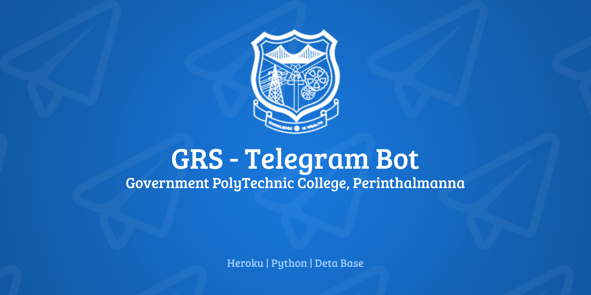

# GRS Telegram Bot
This Telegram Bot is made for the management of the GRS system and Internal Complaints from the Official Telegram Group. This bot forwards all new grievances and complaints received into the GRS and Accept Responses from the telegram group. So, All members in the grievance cell can access and respond to the complaints received without accessing their account in GRS.
